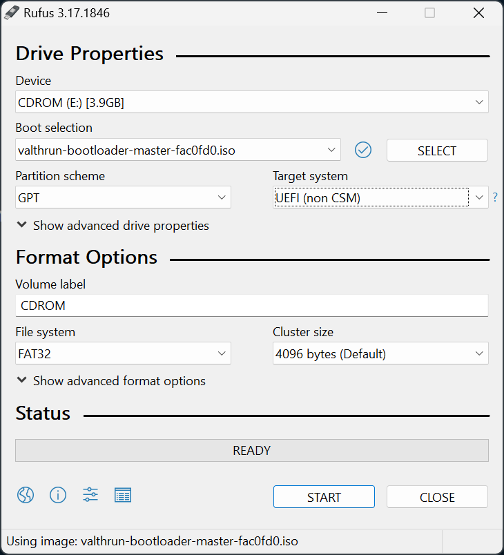
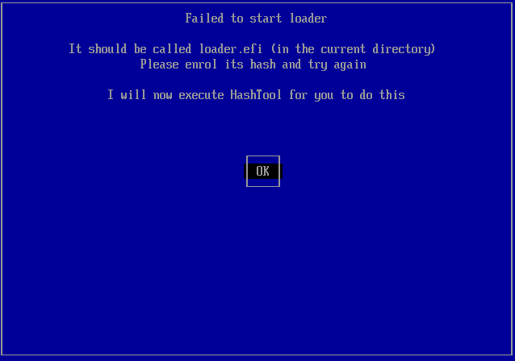
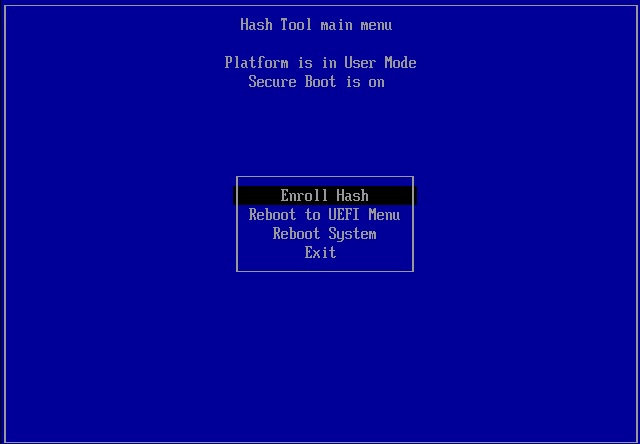
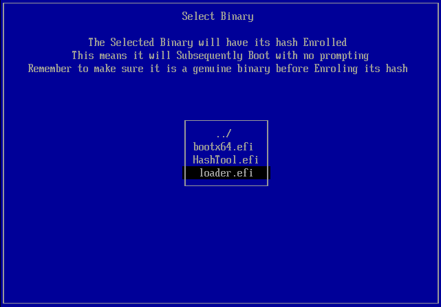
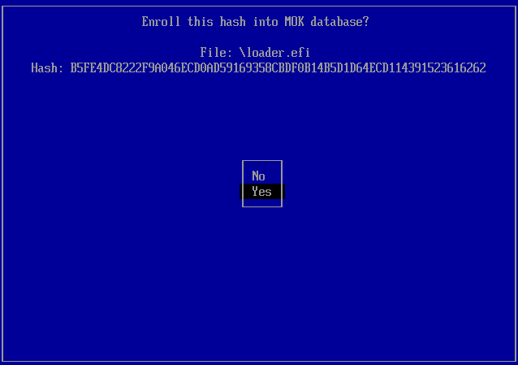
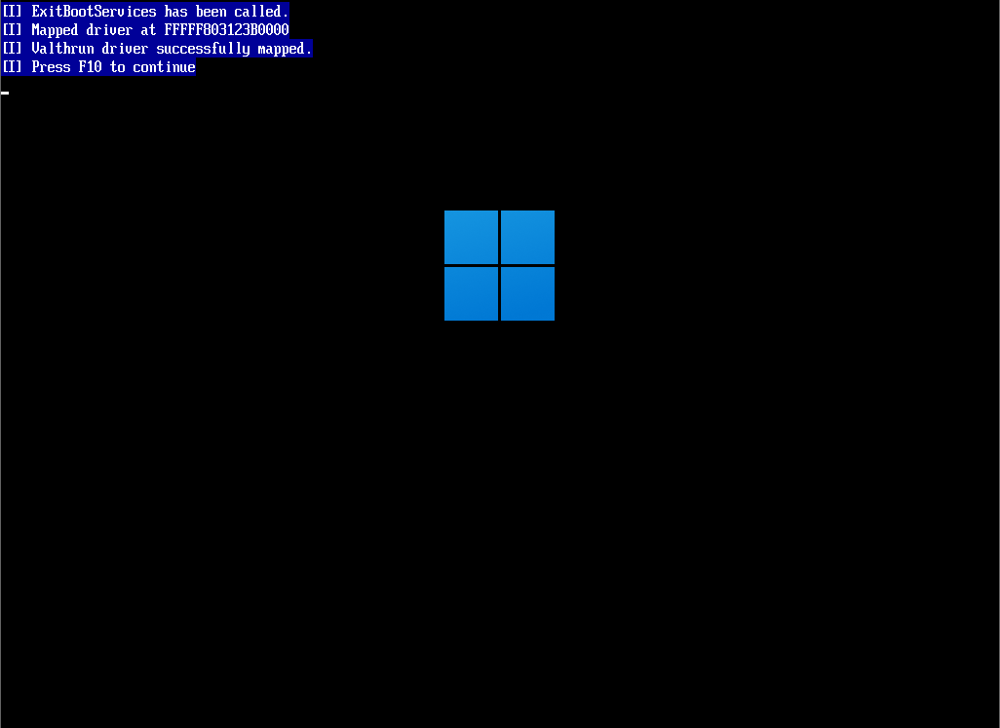

使用Valthrun EFI加载器映射Valthrun驱动程序是一个既直接又有些复杂的过程。为了顺利完成操作，请仔细遵循以下每个步骤。

### 注意事项
**务必在进行后续操作前禁用基于内核级别的系统完整性检查软件（例如，内核防作弊软件）！**  
如果未做此操作，这类软件可能会误判你的系统存在异常行为。

公开提供的Valthrun驱动程序并未设计为隐蔽模式运行，因此可能会触发某些驱动程序供应商的安全机制，它们可能会阻止加载未经签名的驱动。

通过Valthrun EFI加载器，Valthrun驱动将在所有其他已安装驱动之前以最高优先级加载。

### 初始设置
创建包含Valthrun EFI加载器的USB闪存盘是一个简单但需细心的过程。

#### 步骤1：获取引导加载程序
1. 访问[Valthrun GitHub 发布页面](https://github.com/Valthrun/Valthrun/releases/latest)。
2. 下载最新的Valthrun EFI加载器。
3. 解压缩下载的ZIP文件中的ISO镜像。

#### 步骤2：创建可启动U盘
下载了Valthrun EFI加载器后，接下来我们需要制作一个可启动的USB闪存盘。
这里会使用Rufus工具将之前获取的ISO镜像刻录到USB驱动器上。
1. 下载Rufus  
   从[Rufus官方网站](https://rufus.ie/en/)下载Rufus工具。
   
2. 准备闪存盘  
   确保使用的闪存盘当前没有重要数据，因为**其上的所有数据都将被清除**。将闪存盘插入计算机。

3. 打开Rufus  
   运行之前下载的Rufus应用程序。

4. 配置Rufus  
   调整以下相关设置：
   - 设备选择：你的USB闪存盘  
     在设备列表中选择你的闪存盘。
   - 引导选择：Valthrun EFI加载器路径  
     点击“SELECT”按钮，选择提取出来的ISO镜像。
   - 分区方案：`GPT`
   - 文件系统：`FAT32`

配置正确的话，Rufus界面应该如图所示。  

5. 在Rufus中创建Valthrun EFI加载器的USB启动盘
只需点击Rufus界面上的“START”按钮开始创建可启动的闪存驱动器。请耐心等待整个过程结束，直到Rufus完成写入ISO文件和格式化工作，从而生成一个能够用于启动并加载Valthrun EFI加载器的USB闪存盘。在此期间，请勿拔出USB闪存盘，以免造成数据损坏或创建失败。待进度条完成以及Rufus提示操作成功后，即可安全移除并使用该USB启动盘进行后续的操作。

#### 步骤3：从闪存盘启动
创建完带有Valthrun EFI加载器的可启动U盘后，需要从它启动电脑。每次开机时想加载Valthrun都需要如此操作。
1. 重启电脑  
   当可启动U盘准备就绪后，重启计算机。

2. 进入启动菜单  
   启动过程中，按相应主板按键进入启动菜单（通常是F12、F10或Esc键）。

3. 选择闪存盘  
   在启动菜单中选择U盘作为启动设备。选择闪存盘后，你将通过Valthrun EFI加载器启动。

#### 步骤4：注册哈希值（仅当启用了安全启动时）
完成上述步骤并成功从新刻录的Valthrun EFI加载器U盘启动后，如果你开启了安全启动，你需要执行以下操作。如果没有启用安全启动，则跳过这一步！  

1. 注册加载器哈希  
   在主菜单中首先选择`Enroll Hash`并按下`ENTER`键。然后选择要注册的二进制文件哈希，使用方向键选择`loader.efi`，按`ENTER`确认选择文件，当提示是否将其哈希添加至MOK数据库时，选择`yes`并按`ENTER`确认。

1. 重新启动系统  
   注册完成后，可以从主菜单选择`Reboot System`选项重启系统。注意：可能需要再次在启动菜单中选择Valthrun EFI加载器（参见[步骤3](#step-3-boot-from-your-flash-drive)）

  
Show image guide

   
   
   

#### 步骤5：验证Valthrun已成功加载
如果通过efi成功加载了Valthrun，你会看到特定的屏幕。按`F10`键正常启动Windows，一旦Windows启动，Valthrun内核驱动将随之加载。  
  

**专业提示**：  
在按下`F10`键之前，你可以移除USB闪存盘以增强隐秘性。自此步骤之后，在下次系统启动前，不再需要该USB驱动器。

#### 重启后再次映射Valthrun
每次系统关闭时，Valthrun驱动程序都会被卸载。你需要通过Valthrun EFI加载器启动以在系统启动时加载Valthrun驱动。

你可以选择每次手动在启动菜单中选择Valthrun EFI加载器（参照[步骤3](#step-3-boot-from-your-flash-drive)），或者更改系统的启动顺序。
