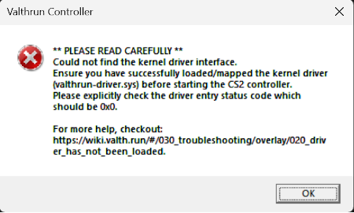

# The kernel driver has not been loaded (`valthrun-driver.sys`)
You're visiting this page as most likely the following message appeared when trying to start the Valthrun overlay:  
  
  
## Causes and solutions
Most certenly this error is caused because the kernel driver (`valthrun-driver.sys`) has not been loaded or failed to load.  
Common pifalls are:
- Simply forgot to map the driver  
  You may just forgot to map the driver. Information on how to load the driver can be found [here](../../010_getting-started/020_driver.md).  
  Note:  
  You have to map the driver again if you have restarted your pm.

- While mapping the driver an error occurred
  Ensure that the process of mapping the driver was successfull.  
  As example for mapping with the kdmapper, you should expect to see the following line after mapping the driver:  
  `[+] DriverEntry returned 0x0`  