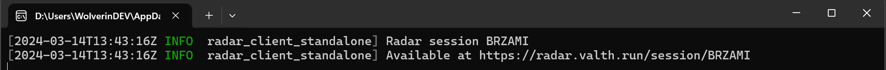

# Standalone web radar
The standalone web radar provides the full web radar experience, without the in game overlay.

## Prerequiresits
Before you can start the standalone web radar you have to optain the following prerequiresits:
1. Download the standalone web radar client  
   Download the latest radar client from GitHub:
   https://github.com/Valthrun/Valthrun/releases/tag/latest

2. Map the kernel driver  
   Similar to the overlay, the standalone web radar client uses the kernel driver to inspects the games memory.
   Ensure you have successfully mapped the kernel driver before using the standalone web radar client.
   Information on how to setup the kernel driver can be found [here](./driver)

## Starting the web radar
Starting the web radar is simple.  
Just execute the `radar_client.exe` executable.  
If the radar has successfully been loaded you should see the following messages:


You can use the link to show the radar on another device or even share a radar with your team mates.

:::note
To view all possible CLI arguments run:
```ps1
radar_client.exe -h
```
:::