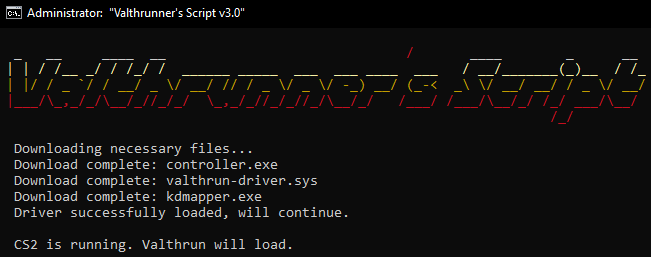

# All in one setup script by Valthrunner
:::warning
This script has been made by @Valthrunner and is not officially supported by Valthrun.  
For assistance or troubleshooting regarding this script, visit `#support-run-script` on the official [Valthrun Discord](https://discord.gg/ecKbpAPW5T).
:::

## Features
- :rocket: **Automatic Updates:** Fetches the latest necessary files seamlessly.
- :sparkles: **Driver Mapping:** Maps the driver effortlessly.
- ⚡ **Convenience:** Simplifies running Valthrun and CS2.

## Get Started :rocket:

1. **Download the Script**: [Release](https://github.com/valthrunner/Valthrun/releases/latest/download/run.bat) (recommended) _or [Main branch](https://github.com/valthrunner/Valthrun/raw/main/run.bat)_.

2. **Run the Script**: Double-click the script (run.bat).

3. **Adjust Video Settings**: Ensure CS2 is in fullscreen windowed or windowed mode for the overlay to display correctly.

4. **Configure Valthrun**: Press the PAUSE key and configure Valthrun (if you can't find it, check out: [Open the GUI without a PAUSE key](../troubleshooting/overlay/pause_key)).

5. **Show Some Love**: Add a Star to these repos: [Script](https://github.com/valthrunner/Valthrun) & [Valthrun](https://github.com/Valthrun/Valthrun)! :star2:

6. **Enjoy** :tada:! 

## Shareable Radar 📡

**Enjoy the built in Valthrun sharable web radar by running [run.bat 🎉](https://github.com/valthrunner/Valthrun/releases/latest/download/run.bat)!**  

## Script Support:
For anything **regarding the Script**, visit `#support-run-script` on the official [Valthrun Discord](https://discord.gg/ecKbpAPW5T).

