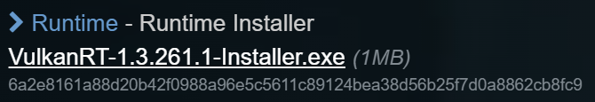
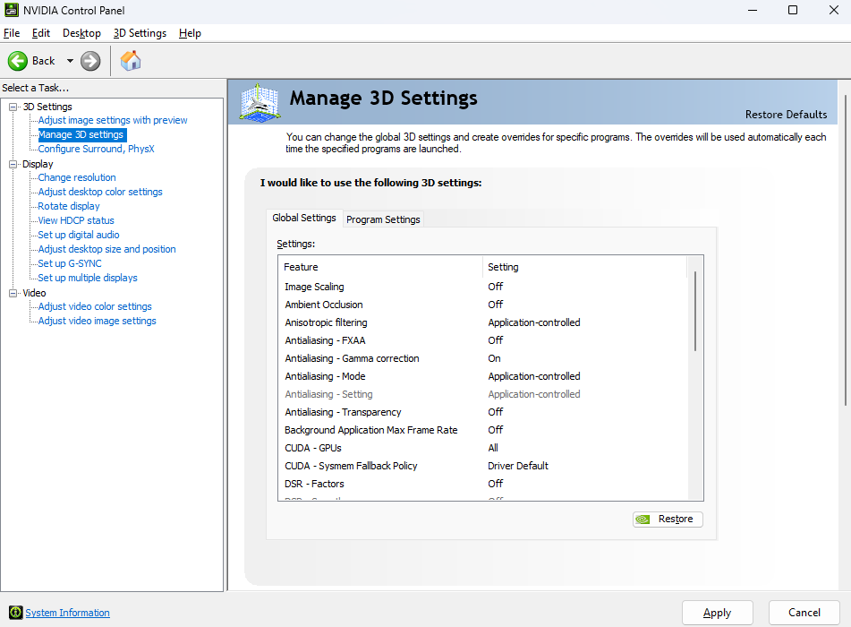
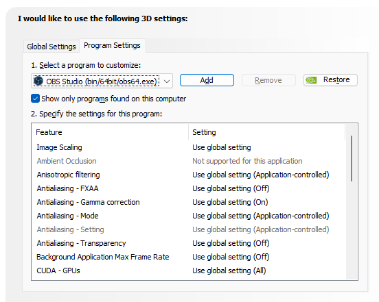
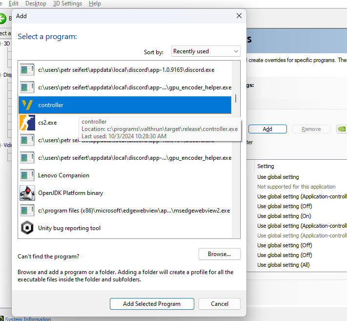

# Vulkan and Graphic Card Issues

Many AMD and Nvidia users may experience issues when attempting to run the Valthrun controller. This issue manifests through various error messages, with common examples including:

- `Unable to find a Vulkan driver`
- `Failed to load vulkan-1.dll (os error 14001)`
- The overlay is black or white instead of transparent
- `A return array was too small for the result`

While the precise cause of these issues is currently unknown, several methods have been reported as effective by different users.

## Issue: `Unable to find a Vulkan driver` or `Failed to load vulkan-1.dll (os error 14001)`

### General Solutions (For Both AMD and Nvidia)

#### Installing the Vulkan Runtime

If you encounter a Vulkan error, installing the Vulkan Runtime may help. You can download and install it from [LunarG’s official site](https://vulkan.lunarg.com/sdk/home) by selecting `Runtime - Runtime Installer`.  

#### Copying `vulkan-1.dll` from Chrome

Another workaround involves copying the `vulkan-1.dll` file from the local installation of Google Chrome and placing it in the directory where `controller.exe` is located.

The `vulkan-1.dll` file for Chrome is usually found in:  
`C:\Program Files (x86)\Google\Chrome\Application\` followed by a folder with the Chrome version number.

:::note
If this does not resolve your issue, delete any `vulkan-1.dll` file located in the same folder as `controller.exe` to prevent additional conflicts.
:::

#### Using Vulkan Configurator (for Detection and FPS Issues)

Directly configuring Vulkan interactions with the controller application or simply opening the Vulkan Configurator can help. Follow these steps if you encounter Vulkan detection or FPS issues.

##### Fixing Vulkan Detection Issues

1. **Choose any of the three configurations**  
   
2. **In the application launcher, click the three dots to add `controller.exe`**  
   
3. **Add `controller.exe` as an option and press launch**  
   

##### Fixing FPS Issues

1. **Open Vulkan Configurator**
2. **Go to "Vulkan Layers Configurations" and adjust `portability`, `synchronization`, and `validation` layers to the “Reduced-overhead” preset**  
   
3. **Test the settings to see which works for you** (portability or synchronization layers typically work best).

## Issue: Overlay is Not Transparent

### General Solutions (For Both AMD and Nvidia) for Overlay Issues

#### Disabling Windows HDR

Disable HDR by going to Settings > System > Display > HDR.

### AMD-Specific Solutions

#### Using AMD's Pro Drivers

Some users have reported success using AMD's Pro drivers. To switch, use Display Driver Uninstaller (DDU) to remove your current drivers and then install the AMD Pro drivers.

#### Downgrading AMD Driver to 23.7.1

For AMD users encountering this issue, downgrading the driver to version 23.7.1 may help. This version is available on AMD's official website, or you can download it directly: [AMD Driver 23.7.1](https://www.amd.com/en/support/kb/release-notes/rn-rad-win-23-7-1).

### Nvidia-Specific Solutions

#### Use Native Present Method

1. **Open NVIDIA Control Panel and go to "Manage 3D Settings"**  
   
2. **Switch to "Program Settings"**  
   
3. **Click "Add" and find `controller.exe`, then click "Add Selected Program"**  
   
4. **Scroll down to `Vulkan/OpenGL present method` and switch it to `Prefer native`**  
   
5. **Apply settings**

## Issue: `vulkan: A return array was too small for the result`

### Affected Systems

This problem occurs specifically on laptops with Nvidia dedicated GPUs (dGPU) together with AMD integrated GPUs (iGPU).

### Solutions

#### Update AMD Drivers

Ensure that your AMD integrated GPU drivers are up to date. Updating to the latest drivers can resolve compatibility issues with Vulkan.

#### Set Preferred GPU in Nvidia Control Panel

Configure your system to use the Nvidia GPU for the controller application.

#### Disable VK_LAYER_AMD_switchable_graphics

Add `DISABLE_LAYER_AMD_SWITCHABLE_GRAPHICS_1` with value `1` into your system environment variables and restart your computer.
