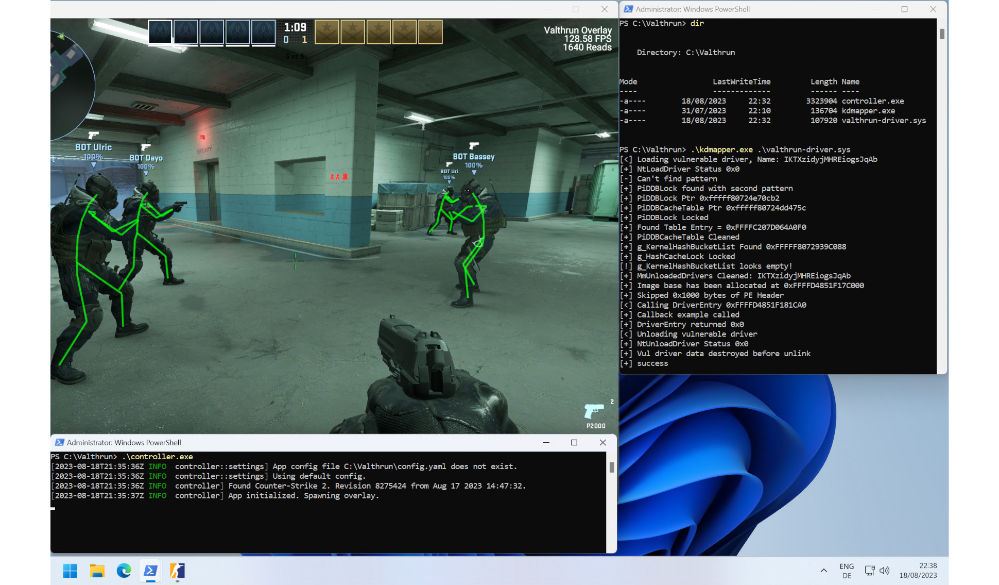
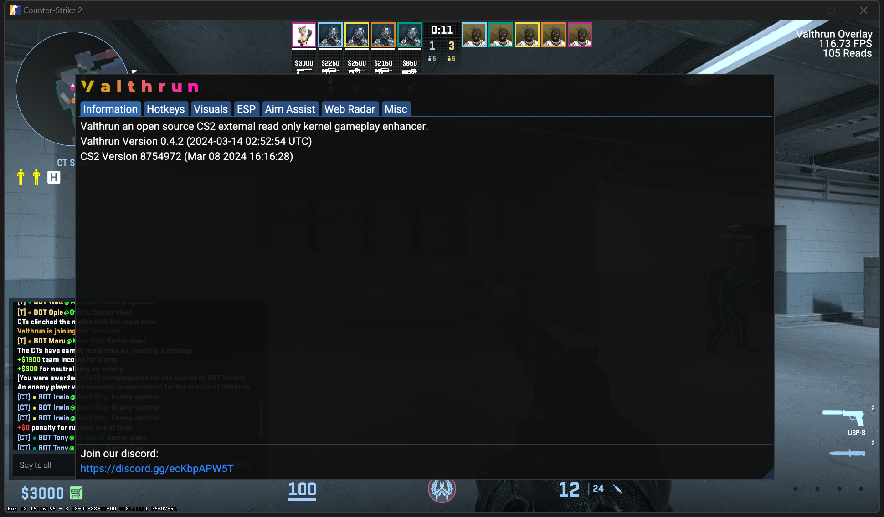

Valthrun is an open source external Counter-Strike 2 read only kernel-level gameplay enhancer.  
That's a lot of descriptive words, but what does each of them mean?  
- `Valthrun` The name of this project
- `open source` This application is open source and for everyone to learn from
- `external` We do not inject any DLLs into the target process
- `read only` We do not write to the CS2 process in any way, therefore being impossible to detect by scanning the process memory
- `kernel` We do not use any user level WinAPIs in order to get information from the CS2 process
  
This project is mainly a fun example for exploring the Windows Kernel with [Rust](https://www.rust-lang.org) and exploring the world of game enhancements :)

:::warning
Valthrun is **not** a plug 'n play solution.  
Instead Valthrun aims to achieve maximum stealth and stay invisible for other applications.  
Please read [Getting started](./getting-started/) carefully and try to troubleshooting issues on your own.  
:::
  
## Features
Due to Valthrun being read-only (as of now), there are limitations on what features are possible to implement (eg. skin changer).
Regardless of this limitation, Valthrun supports the following features:  

- External radar  
  Publish your game for everybody on https://radar.valth.run
- Player ESP  
  ESP with a lot of configuration possibilities like: `Skeleton`, `Boxes3D` and `Boxes2D` 
  - Configurable colors to distinguish between enemy and team players
  - ESP includes player health, a health bar, weapon and a lot more
- Bomb Info
  - Time until the bomb detonation
  - Defuser info such as a defuse timer
  - Bomb site where the bomb is located
- Trigger Bot  
  Shoot your enemy (or team mates) as soon they enter your crosshair
- Spectator info
  - List of player currently watching you / the observer target
- Stream proof by default  
  Never show your Valthrun overlay on any screen shares

To access Valthruns settings overlay press `PAUSE`.

<h3>Planned Features</h3>
- Aimbot
- Player competitive ranks / wins

## VAC Considerations
The same considerations as mentioned in [this link](https://github.com/dretax/GarHal_CSGO#starting-driver) have been taken into account.  
With these precautions and some minor improvements, such as omitting the Valthrun identifier and using xor encryption for strings, the driver/overlay should avoid VAC detection. However, I must clarify that I haven't extensively studied VAC, so my conclusion is speculative. Personally, I have been using a C based driver/overlay like this with CSGO for several years without ever getting VAC banned. But be aware of overwatch!  
With VAC live being enabled now, use this with caution. As always take the necessary precautions into consideration.

## Screenshots

## Help
You can find help on the official Valthrun Discord server:  

